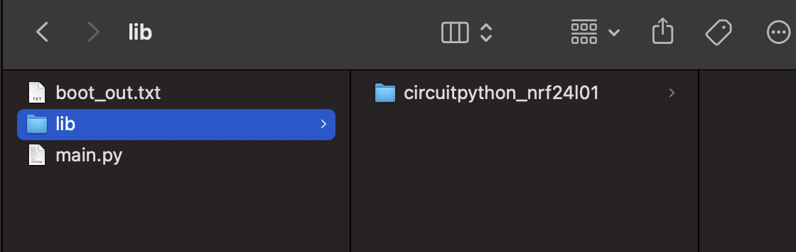
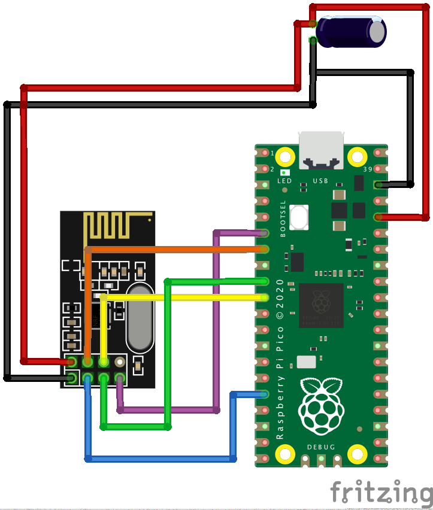

# Raspberry Pi Pico and nRF24L01(+) transceiver using Circuitpython
This Github repository demonstrates how to connect a Raspberry Pi Pico and a nRF24L01(+) transceiver using [CircuitPython](https://circuitpython.org/). It provides the necessary instructions and resources to get you started.

# Introduction
I was unable to locate a functional example of using a nRF24L01(+) transceiver with a Raspberry Pi Pico using CircuitPython. While I did find the tutorials [How to easily connect a NRF24L01+ transceiver to your Raspberry Pi Pico](https://coffeebreakpoint.com/micropython/how-to-connect-a-nrf24l01-transceiver-to-your-raspberry-pi-pico/) and [Raspberry Pi Pico with nRF24L01 using MicroPython](https://bekyelectronics.com/raspberry-pi-pico-nrf24l01-micropython/), they were not helpful as they were written for MicroPython. However, I did come across a promising library called [CircuitPython_nRF24L01](https://circuitpython-nrf24l01.readthedocs.io/en/latest/index.html#using-the-examples), but unfortunately, the code does not work on a Raspberry Pi Pico (RP2040).

### Using the examples

In order to get the CircuitPython_nRF24L01 code working on a Raspberry Pi Pico, I started with the original example files from the [CircuitPython_nRF24L01](https://github.com/nRF24/CircuitPython_nRF24L01/) repository and made some minor modifications, such as specifying the correct pins. Here are the steps to follow:

> 1. Download the contents of the [CircuitPython_nRF24L01](https://github.com/nRF24/CircuitPython_nRF24L01/) repository.
> 2. Copy the `circuitpython_nrf24l01` folder to the `lib` folder on your Pico.
> 3. Download the appropriate example file from this repository and rename it to `main.py` or `code.py`.
> 4. Run the code and you should be all set!

The file and folder structure on your Pico should be similar to this:

## Wiring

| Pico                                | NRF24L01+ |
|-------------------------------------|-----------|
| Pin 36 / 3V3 Out                    | VCC       |
| Pin 38 / GND (or any other GND Pin) | GND       |
| Pin 16 / GP12                       | CE        |
| Pin 7 / GP5                         | CS        |
| Pin 9 / GP6                         | SCK       |
| Pin 10 / GP7                        | MOSI      |
| Pin 6 / GP4                         | MISO      |

**Note:** To improve stability, you can add a capacitor between the VCC and GND pins of the nRF24L01. In my experience, a 10uf capacitor worked well. 
